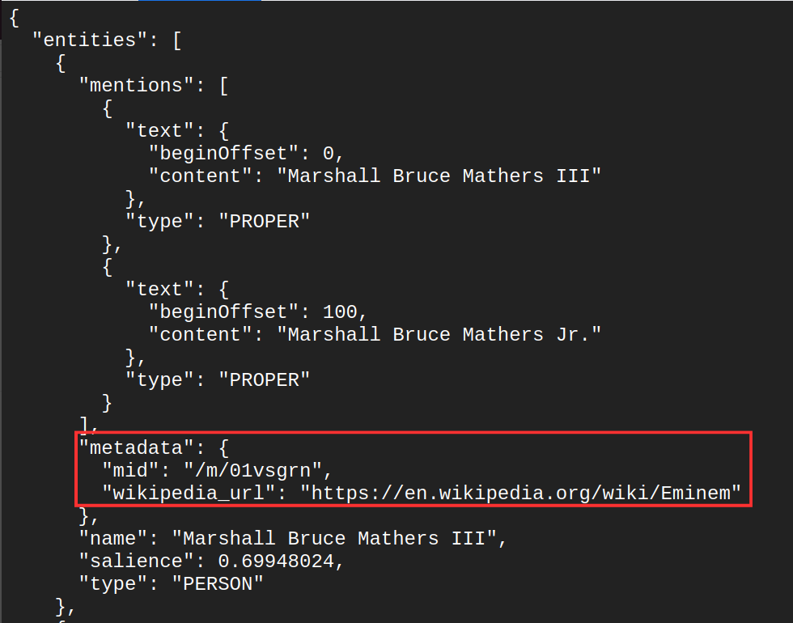

# Google Machine Learning API

> For more information about the topic, please refer to the presentation slides that have already been shared with you.

> Please make sure you have already done all the prerequisite tasks before continuing with this topic.

## PREPARATION

**1. Get Ready With the Terminal/Console**

- There are several ways to use the terminal in GCP.

  **1. Cloud Shell**

  - Click on the icon to activate the cloud shell
    

    

      
    

    

  - If the project is not configured yet on your shell, run this command.
    > gcloud config set project [PROJECT_ID]
  - Replace **[PROJECT_ID]** with your own project id.

  **2. Local Terminal(Local Device)**

  - For using another terminal such as a local terminal or other remote terminal, you will need to install the Google Cloud SDK.
  - You can refer to this [GUIDE](https://cloud.google.com/sdk/docs/install) for the installation.

**2. Get the Material Ready For Cloud Shell**

- Click on the **3-dot** icon above the cloud shell panel and choose **"Upload"**.
  

  

    
  

  

- Choose **"folder"**, click **"Choose Folder"** button and upload **"01_Google_ML_API"** folder to the cloud shell.
  

  

    
  

  

- Run this command on the shell to verify the process.

  > ls

  ***

  

  

    
  

  

## Google Vision API - [Documentation](https://cloud.google.com/vision/docs/features-list)

There are many ways to use this APIs based on the documentation. For this training, we will be focused on 3 ways:

- **Using Raw API**
- **Using Gcloud Library**
- **Using Python Code**

When using image data, there are some features that these APIs are capable to do.

> - **Labels Detections**
>   - Detect and extract **information about entities** in an image, across a broad group of categories.
> - **Landmark Detections**
>   - Detects popular **natural and human-made structures** within an image.
> - **Logo Detections**
>   - Detects popular **product logos** within an image.
> - **Object Localization**
>   - Detect and extract **multiple objects** in an image.
> - **Face Detections**
>   - Detects **multiple faces** within an image along with the associated key facial attributes such as emotional state or wearing headwear.
> - **SafeSearch Detections**
>   - Detects **explicit content** such as adult content or violent content within an image.
> - **Web Detections**
>   - Detects **web references** to an image.
> - **Optical Character Recognition (OCR)**
>   - Detect **text on a document** or **text of handwriting**.

**1. Using Raw API**

- Change the terminal directory to **01_Google_ML_API/Object_Detection/curl** by running this command.
  > cd 01_Google_ML_API/Object_Detection/curl
- Open the curl.sh by running this command on the terminal.

  > nano curl.sh

  ***

  

  

    
  

  

- Copy the content of the curl.sh file and press **ctrl+X** to close the nano application.
- Change the **"mlops-training-class"** with your own project id.
- Paste this command on the terminal and press enter.
- You will get results like this.

  - **Description** means the **label name**.
  - **Score** means the **confident level**.
  - **Topicality** means the **relationship between the label and the image**.

  

    

      
    

  

- To change the image, number of labels, or the type of detection, you can modify it on request.json
  

  

    
  

  

- For the image, it can be from internet, local machine(Need to be upload on your cloud shell) or from the cloud storage's bucket itself.
- For the type of detection, please refer to the [documentation](https://cloud.google.com/vision/docs/features-list) for what parameter to be used for each type of detection.
  

**2. Using Gcloud Vision Library**

- You can use the gcloud vision library immediately without installation if you are using cloud shell. In contrast, if you are using the local terminal or other remote terminal, you need to install Google Sdk first.

- For using this gcloud vision library, you can just run this command. This is an example of label detection using the gcloud vision library.

  > gcloud ml vision detect-labels --max-results=2 "https://www.animalife.co.uk/wp-content/uploads/2021/07/Thoroughbred.jpg"

- You will get the result like this.
  

  

    
  

  

- To change the image, just change the URL.
  

  

    
  

  

- To change the max results, just change the **"2"** to another number.
  

  

    
  

  

- To change the type of detection, you can change the **"detect-labels"** in the command into another detection
  

  

    
  

  

- These are some examples of other detection

  > gcloud ml vision detect-landmarks "https://upload.wikimedia.org/wikipedia/commons/thumb/1/1f/Taj_Mahal_N-UP-A28-a.jpg/640px-Taj_Mahal_N-UP-A28-a.jpg"
  >
  > ***
  >
  > gcloud ml vision detect-logos "https://upload.wikimedia.org/wikipedia/commons/thumb/2/2f/Dyson_logo.svg/1280px-Dyson_logo.svg.png"

- For more information about the Google Vision API using the gcloud library, you can refer to the help command in the terminal.

  > gcloud ml vision --help 

**3. Using Python**

- You can also integrate these APIs with your system. For this training, we will use the Python code.
- In the training materials, there are codes to use this API using Python. In /01_Google_ML_API/Google_Vision/Object_Detection/02_Python, there are 5 snippet of code:

  1. detect_labels.py
  2. detect_landmarks.py
  3. detect_logos.py
  4. detect_objects.py
  5. main.py

- In **code 1 - 4**, the code will call out the functions from **main.py**
  

  

    
  

  

- In **main.py**, there are some modules/functions used to send an API request to Google's prediction server.
  

  

    
  

  

- **How to use it?**

1. Change the terminal directory to **/01_Google_ML_API/Object_Detection/python** by running this command.
   > cd ~ \
   > cd 01_Google_ML_API/Object_Detection/python
2. Run **python code 1-4** one by one using this command.
   > - python detect_labels.py
   > - python detect_landmarks.py
   > - python detect_logos.py
   > - python detect_objects.py
   >   

3. If you want to change the image, you can change it on the **python code 1-4**.
   

   

     
   

4. If you want to test another type of detection using Python, please refer to this [documentation](https://cloud.google.com/vision/docs/features-list).

## Natural Language Processing API - [Documentation](https://cloud.google.com/natural-language/docs/setup)

There are many ways to use this APIs based on the documentation. We are already done using 3 ways in Google Vision API:

- **Using Raw API**
- **Using Gcloud Library**
- **Using Python Code**

**However, for this NLP API, we will only use Gcloud Library**

- You can use the gcloud library immediately without installation if you are using cloud shell. In contrast, if you are using the local terminal or other remote terminal, you need to install Google Sdk first.

When using text data, there are some features that these APIs are capable of doing.

> - **Entity Analysis**
>   - Inspects the **given text for known entities (proper nouns such as public figures, landmarks, etc.)**, and returns information about those entities.
> - **Sentiment Analysis**
>   - Inspects the given text and identifies the **prevailing emotional opinion** within the text, especially to determine a writer's attitude as **positive, negative, or neutral**.
> - **Entity Sentiment Analysis**
>   - It combines both entity analysis and sentiment analysis and attempts to **determine the sentiment (positive or negative) expressed about entities** within the text.
> - **Syntax Analysis**
>   - Inspects the **structure of the language** within the text.
> - **Content Classification**
>   - Analyzes a text or a document and returns a list of **content categories** that apply to the text found in the document.
> - **Text Moderation**
>   - Analyzes a document against a **list of safety attributes**, which include "harmful categories" and topics that may be considered sensitive.

## **1. Entity Analysis**

> **We will take an example from [Eminem Wikipedia](https://en.wikipedia.org/wiki/Eminem)**\
> "Marshall Bruce Mathers III was born on October 17, 1972, in St. Joseph, Missouri, the only child of Marshall Bruce Mathers Jr. and Deborah Rae "Debbie". He is of Scottish, Welsh, English, Cherokee, German, Swiss, Polish, and possibly Luxembourgish ancestry."

- Open your cloud shell terminal and run this command.
  > gcloud ml language analyze-entities --content="Marshall Bruce Mathers III was born on October 17, 1972, in St. Joseph, Missouri, the only child of Marshall Bruce Mathers Jr. and Deborah Rae "Debbie". He is of Scottish, Welsh, English, Cherokee, German, Swiss, Polish, and possibly Luxembourgish ancestry."
- You will get a result like this which you will get in JSON format.
  

  

    
  

  

- The first part of the result of an entity is the **"mentions"** which will identify how many times the entities occur in the block of text. In this example it detects the real name of Eminem has been mentioned twice although the content is not the same.
  

  

    
  

  

- It also can detect the metadata of the entity itself such as the Wikipedia source of the entity
  

  

    
  

  

- Lastly, it will the result will also show the attributes of the entity:

  - **Name** of the entity
  - **Salience** of the entity which is **score of how important the entity is to the text or documents**
  - **Type** of entity, whether it is a PERSON, LANDMARK, etc.

    

    

      
    

    

- If you face any problem, you can just use this command.
  > gcloud ml language analyze-entities --help
- If you want to use these features in raw APIs, Python, or any other code, you can refer to this [documentation](https://cloud.google.com/natural-language/docs/analyzing-entities)

## **2. Sentiment Analysis**

> **We will take an example from [Eminem Wikipedia](https://en.wikipedia.org/wiki/Eminem)**\
> "His mother nearly died during her 73-hour labor with him. Eminem's parents were in a band called Daddy Warbucks, playing in Ramada Inns along the Dakotas–Montana border before they separated. His father abandoned his family when Eminem was a year and a half old, and he was raised only by his mother, Debbie, in poverty."

- Open your cloud shell terminal and run this command.

  > gcloud ml language analyze-sentiment --content="His mother nearly died during her 73-hour labor with him. Eminem's parents were in a band called Daddy Warbucks, playing in Ramada Inns along the Dakotas–Montana border before they separated. His father abandoned his family when Eminem was a year and a half old, and he was raised only by his mother, Debbie, in poverty."

- You will get a result like this which you will get in JSON format.
  

  

    
  

  

  - The sentiment of each sentence in the block of text will be returned.
    - **Magnitude**
      - Indicates the overall strength of emotion (both positive and negative) within the given text from 0.0 to inf+.
      - Usually, neutral documents will have a low magnitude value, while mixed sentiment documents will have higher magnitude values.
    - **Score** - Indicates the sentiment value within the given text between -1.0 to 1.0. - 0 means neutral, negative values indicate negative sentiment while positive values indicate positive sentiment. - You can see in the example below where the sentence "His mother nearly died during her 73-hour labor with him." returns **-0.7** score which indicates this sentence has **negative sentiment** on it.
    

    

      
    

    

- If you face any problem, you can just use this command.
  > gcloud ml language analyze-sentiment --help
- If you want to use these features in raw APIs, Python, or any other code, you can refer to this [documentation](https://cloud.google.com/natural-language/docs/analyzing-sentiment)

## **3. Sentiment Entity Analysis**

> **We will take an example from [Eminem Wikipedia](https://en.wikipedia.org/wiki/Eminem)**\
> "His mother later had a son named Nathan "Nate" Kane Samara. At age twelve, he and his mother had moved several times and lived in several towns and cities in Missouri (including St. Joseph, Savannah, and Kansas City) before settling in Warren, Michigan, a suburb of Detroit. Eminem frequently fought with his mother, whom a social worker described as having a 'very suspicious, almost paranoid personality'. He wrote letters to his father, but Debbie said that they all came back marked 'return to sender'."

- Open your cloud shell terminal and run this command.

  > gcloud ml language analyze-entity-sentiment --content="His mother later had a son named Nathan "Nate" Kane Samara. At age twelve, he and his mother had moved several times and lived in several towns and cities in Missouri (including St. Joseph, Savannah, and Kansas City) before settling in Warren, Michigan, a suburb of Detroit. Eminem frequently fought with his mother, whom a social worker described as having a 'very suspicious, almost paranoid personality'. He wrote letters to his father, but Debbie said that they all came back marked 'return to sender'."

- This will combine the results from sentiment analysis and entity analysis. You will get a result like this which you will get in JSON format.
  

  

    
  

  

- First, it will give the result of an entity the **"mentions"** which will identify how many times the entities occur in the block of text. In this section also there will be the sentiment value for each sentence where the entity is located.
  

  

    
  

  

- It will also return metadata if there is one and the attributes of the entities such as entity name, the salience, and also the sentiment attributes.
  

  

    
  

  

- If you face any problem, you can just use this command.

  > gcloud ml language analyze-entity-sentiment --help

- If you want to use these features in raw APIs, Python, or any other code, you can refer to this [documentation](https://cloud.google.com/natural-language/docs/analyzing-entity-sentiment)

## **4. Content Classification**

> **We will take an example from [NY Times](https://www.nytimes.com/interactive/2023/12/07/travel/things-to-do-vienna-austria.html)**\
> "The Wien Museum, focused on the city’s history, reopened on Dec. 6 on Karlsplatz, a sweeping plaza with a Baroque church, with several new wings and a large terrace, nearly doubling its former size. The museum’s straight lines and white concrete set it apart from the opulent marvels erected by the Hapsburgs, the dynasty that ruled Austria for more than 600 years, like the Belvedere and Kunsthistorisches Museum. The new permanent exhibition (free admission) traces Vienna’s history through objects, including the exterior wall of a store that a Jewish businessman was forced to liquidate before he fled Austria after the country was annexed by Nazi Germany. Regular Viennese people are as much of a focus here as the elites — a Gustav Klimt painting, for example, hangs near an early-1900s folding bed used by servants, a slice of working-class Viennese life."

- Open your cloud shell terminal and run this command.

  > gcloud ml language classify-text --content="The Wien Museum, focused on the city’s history, reopened on Dec. 6 on Karlsplatz, a sweeping plaza with a Baroque church, with several new wings and a large terrace, nearly doubling its former size. The museum’s straight lines and white concrete set it apart from the opulent marvels erected by the Hapsburgs, the dynasty that ruled Austria for more than 600 years, like the Belvedere and Kunsthistorisches Museum. The new permanent exhibition (free admission) traces Vienna’s history through objects, including the exterior wall of a store that a Jewish businessman was forced to liquidate before he fled Austria after the country was annexed by Nazi Germany. Regular Viennese people are as much of a focus here as the elites — a Gustav Klimt painting, for example, hangs near an early-1900s folding bed used by servants, a slice of working-class Viennese life."

- You will get a result like this which you will get in JSON format.
  

  

    
  

  

- The blocks of text are categorized into category/categories and will be sorted by the confidence of the classification.
  

  

    
  

  

- If you face any problem, you can just use this command.
  > gcloud ml language classify-text --help
- If you want to use these features in raw APIs, Python, or any other code, you can refer to this [documentation](https://cloud.google.com/natural-language/docs/classifying-text)

  > We will skip the **Syntax Analysis** and **Text Moderation** for this traning. However, feel free to try these features as well as different ways to connect with all of these APIs. You can play around by using raw APIs or even using programming languages such as Java or Python.\
  > **As a summary, these APIs provided by GCP a good functions for you if you don't have data and your problem is not very specific and can be solved with these APIs.**

## Speech-to-Text - [Documentation](https://cloud.google.com/speech-to-text/docs/speech-to-text-requests)

There are many ways to use this APIs based on the documentation. We are already done using 3 ways in Google Vision API:

- **Using Raw API**
- **Using Gcloud Library**
- **Using Python Code**

**However, for this Speech-to-Text API, we will only use Gcloud Library**

- You can use the gcloud library immediately without installation if you are using cloud shell. In contrast, if you are using the local terminal or other remote terminal, you need to install Google Sdk first.

Let's use an example that is already given in the materials folder. At the preparation stage, we already uploaded all of the materials for Google ML API into the cloud storage.

- Go to your cloud storage and find the **"test.flac"** in **"01_Google_ML_API/Speech2Text/"** folder.
- Right-click on the 3 dots right side of the **"test.flac"** and click on the **"Copy gsutil URI"**
  

  

    
  

  

- Open your cloud shell terminal and run this command. However, you need to change the path of the flacc file to the path that you have copied before.
  > gcloud ml speech recognize "gs://trainer-bucket-6557/01_Google_ML_API/Speech2Text/test.flac" --language-code="en-US"
  ***
  

  

    
  

  

- You will get a result like this which you will get in JSON format.

  - **Transcript** is the speech in text
  - **Confidence** is the confidence level of the model toward the result.
    

    

      
    

    

- If you face any problem, you can just use this command.
  > gcloud ml speech recognize --help
- If you want to use these features in raw APIs, Python, or any other code, you can refer to this [documentation](https://cloud.google.com/text-to-speech/docs/samples)
