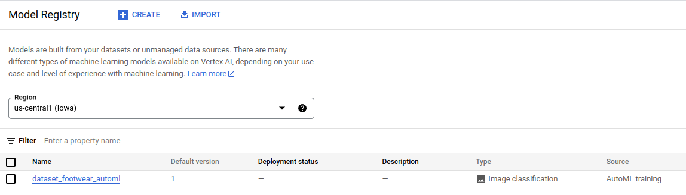
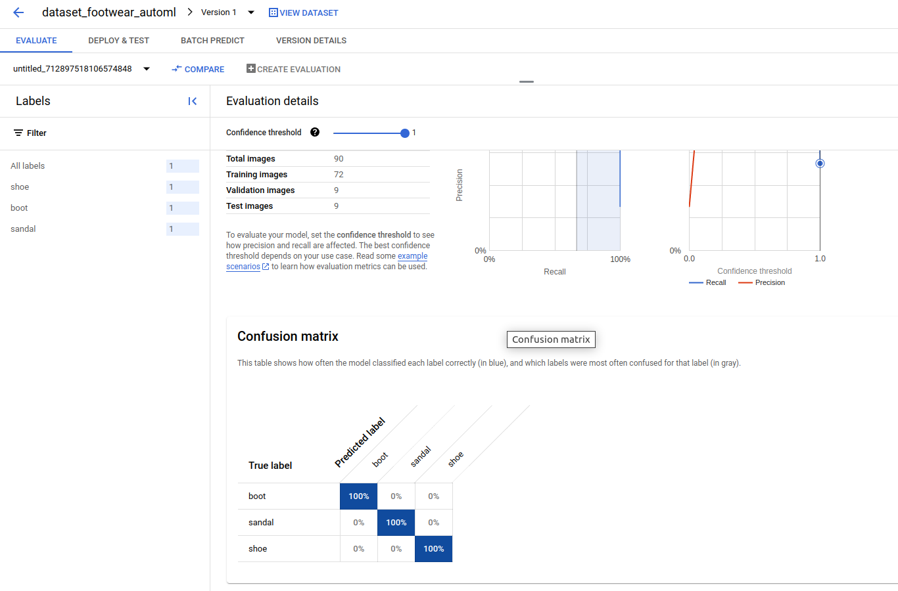
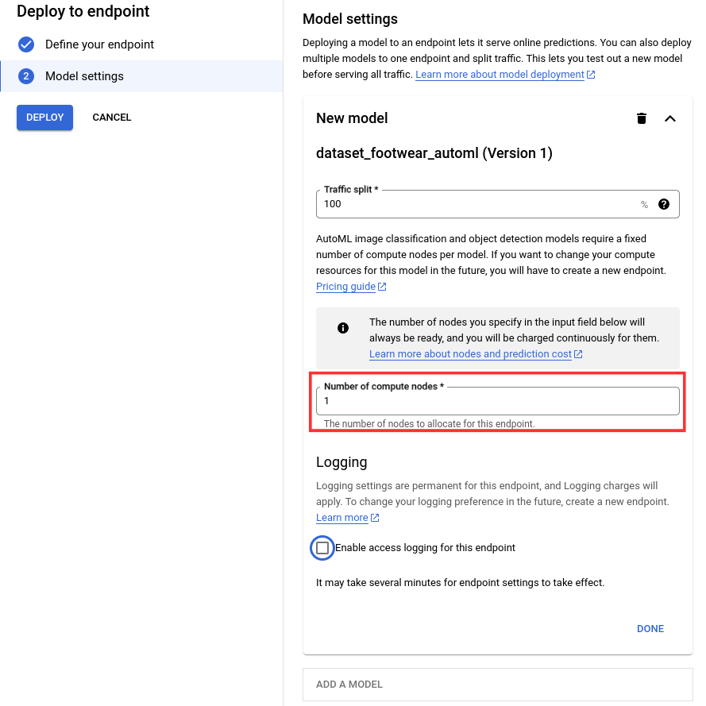
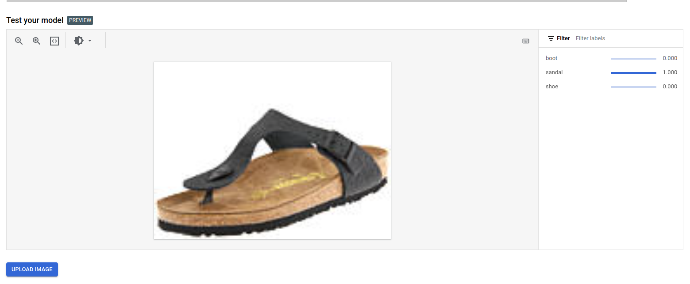
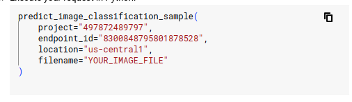
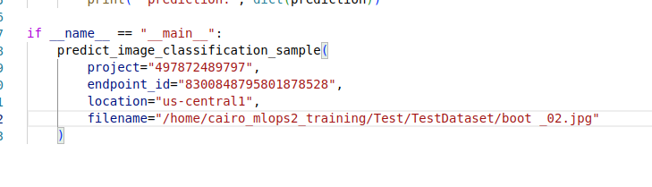
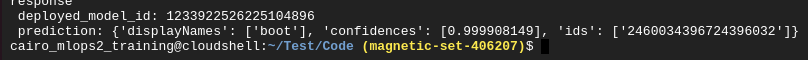
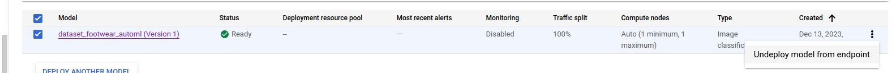

# AutoML

> For more information about the topic, please refer to the presentation slides that have already been shared with you.

> Please make sure you have already done all the prerequisite tasks before continuing with this topic.

## PREPARATION

**1. Get Ready With the AutoML Folder**

- Go to Google Storage's bucket and create a new folder for your AutoML topic.
  

  

    
  

  

- Then go inside the folder and create another folder named **"Data"**
  

  

    
  

  

**2. Get Ready With the Terminal/Console**

- Click on the icon to activate the cloud shell
  

  

    
  

  

- If the project is not configured yet on your shell, run this command.
  > gcloud config set project [PROJECT_ID]
- Replace **[PROJECT_ID]** with your own project id.

## AutoML Vision

### 1. Dataset Preparation - [Documentation](https://cloud.google.com/vertex-ai/docs/image-data/classification/prepare-data#csv)

There are 2 ways to create a dataset:

#### 1. Upload directly to the Dataset Creation Page.

- This way is usually used if your **data is not labeled yet**.
- Steps:

  1.  Make sure you already created the **"Data"** folder in your bucket.
  2.  Go to your GCP console and search for **Vertex AI**
  3.  On the left-sidebar, choose **"Dataset"**.

        

        

        
        

        

  4.  Click on **"Create"** and this tab will be popup.
      

      
      

      

  5.  This is how you create a dataset.

      - Fill up the dataset name.
        

        

          
        

        

      - For the current subtopic, we will do multi-label image classification. Therefore here is the setting you need to choose.
        

        

          
        

        

      - Choose the region of your choice. We recommended **"central-us1"** as this region supports AutoML. Not all regions support AutoML and one of them is **Singapore**.
        

        

        
        

        

        > Make sure you remember the region that you choose. **Dataset region and Training region must be the same**.

  6.  Choose **"Upload images from your computer"**, click on **"Select Files"** and select all images in workshop material located on **"/02_AutoML/image_classification/Data"**
      

      

        
      

      

  7.  At the bottom of the page, there will be an option to choose Google Storage's path. Click **"Browse"** and choose the **"Data"** folder we created before.
      

      

        
      

      

      > This process will take several minutes to complete.

  8.  After the dataset is created, you will be redirected to the dataset page and you will need to label all of your images according to their class.

      - Click on **"ADD NEW LABEL"** to create labels. Create labels for **shoe**, **boot**, and **sandal**.
        

        

        
        

        

      - Then, you can choose the image/images by clicking the yellow circle at the top of the images, clicking **"ASSIGN LABELS"**, and choosing what label you want to classify the selected images.
        

        

        
        

        

      - Repeat this process until all images are labeled.
        

        

        
        

        

---

#### 2. Create a dataset from data inside Google Storage's bucket.

- This way is usually used if your **data is already labeled**.

  1. If you have already done the first way to create a dataset, you can follow this directly in this tutorial. If not, you will need to upload your images first into the bucket.
  2. Then, we will need to prepare the labeling file for the dataset in the form of a CSV file.

     - Open the cloud shell terminal and upload **"label_create.py"** into the terminal. This file is located in the materials folder **"02_AutoML/image_classification/label_create.py"**
     - After that, click on **"Open Editor"** at the top of the cloud shell terminal.
       

       

       
       

       

     - Navigate to the **"label_create.py"** file and change the value of **BUCKET_NAME** to your bucket name and **PREFIX** to location of your images reside.
       

       

       
       

       

     - After change it, click **CTRL+S** to save the file and press **"OPEN TERMINAL"** to go back to terminal.
       

       

       
       

       

     - Run the Python code by using this command.
       > python label_create.py
       ***
     - If everything is okay, your CSV file should be created on Google Storage like this.
       

       

       
       

       

  3. Now you will **repeat the process of making the dataset using the first way until step 5**.
  4. After that, choose **"Select import files from cloud storage"**, click on **"Browse"**, and select the CSV file that we created before in Google Cloud.
       

       

       
       

       

       

       
       

       

       
     > This process will take several minutes to complete.

### 2. Training Image Classification Model Using AutoML Vision - [Documentation](https://cloud.google.com/vertex-ai/docs/image-data/classification/train-model)

1.  Go to your GCP console and search for **Vertex AI**
2.  On the left-sidebar, choose **"Training"**.

    

    

    
    

    

3.  Now, click on the **"TRAIN NEW MODEL"** button on the top of the page.
    

    

    
    

    

4.  Initially, you will see 4 configuration tabs for training the AutoML model.

    #### 1. Training Method

    - At this tab, first, you will need to choose your dataset. Feel free to choose between 2 datasets that you have made. However, make sure all labeling processes are done for the dataset that you choose.
      

      

        
      

      

    - Then, for the **model training methods**, we will choose AutoML for now.
      

      

        
      

      

    - Lastly for the **Choose where to use your model**, you can choose **"Cloud"** if you want to deploy the model on the GCP endpoint. You cannot export the model outside if you choose this.
    - If you want to use the model externally, you can choose **"Edge"**. However, please take note that the pricing between these two is different.
    - For this workshop, we will just choose **"Cloud"**.
      

      

        
      

      

    #### 2. Model Details

    - For this workshop, as we only train 1 model for this dataset, we will choose **"Train new model"**. If you want to train a new version of an existing model, choose the other option as you can do a performance comparison between different versions of the model.
      

      

        
      

      

    - If you clicked on the **"Advanced Options"**, you can adjust the splitting of data between **Training Set**, **Validation Set** and **Test Set**. We will use the default version which is 80% training set, 10% validation set, and 10% test set.
      

      

        
      

      

    #### 3. Training Options

    - As for the training options tab, we will use **"Default"** as the goal. This is important because with the **"Higher Accuracy(New)"** goal, the **early stopping option** on the **"Compute and Pricing"** tab is not available.
      

      

        
      

      

    - If you already have a base model, you can do incremental training/transfer learning by enabling the incremental training options.

    #### 4. Explainability

    - In this tab, you can choose whether to enable the explainability option for the training process.
    - These features allowed you to verify that the model is behaving as expected, recognize bias in your models, and get ideas for ways to improve your model and your training data with some additional cost.
    - This is an example of MLOps tools available on the GCP.
    - However, for the sake of the workshop, we will **disable** this feature.

    #### 5. Compute and Pricing

    - This is the last configuration tab before you can start your training process.
    - Here, you can put the maximum number of node hours you want to spend training your model 8 hours and above.
    - If you set the node hours to 8, the training hours for your model will not exceed that.
    - However, if you enable the early stopping options, even if you set your maximum number of node hours to 8, your training will stop if the model cannot improve anymore even if it is less than 8 hours and you will only be charged for the amount of time that you used.
      

      

        
      

      

      > The training process is time-consuming. It can take 2-8 hours(Depending on your maximum nodes).

5.  After the training process is completed, your model will be shown on your training page.
    

    

      
    

    

### 4. Model Deployment and Endpoint Creation - [Documentation](https://cloud.google.com/vertex-ai/docs/image-data/classification/get-predictions)

After your training is done, your model should be registered in **"Model Registry"** automatically. You can check this by:

- Search for **Vertex AI** on the GCP search tab
- On the left-sidebar, choose **"Model Registry"**.
- Your model should be shown there.
    

    

      
    

    

- Click on the model to go to the model information page.
    

    

      
    

    

- On this page, you can check all the information about your model
  - **Precision**
    - The percentage of predictions that were correct (positive). The higher the precision, the fewer false positives predicted.
  - **Recall**
    - The percentage of all ground truth items that were successfully predicted by the model. The higher the recall, the fewer false negatives, or the fewer predictions missed.
  - **Precision-Recall Curve**
    - Trade-off between precision and recall at different confidence thresholds. A lower threshold results in higher recall but typically lower precision, while a higher threshold results in lower recall but typically with higher precision.
  - **Precision-Recall By Threshold**
    - Model performance on the top-scored label along the full range of confidence threshold values. A higher confidence threshold produces fewer false positives, which increases precision. A lower confidence threshold produces fewer false negatives, which increases recall.
  - **Confusion Matrix**
    - It represents the prediction summary in matrix form. It shows how many predictions are correct and incorrect per class. It helps in understanding the classes that are being confused by the model as other classes.
- So to use the model for deployment, we need to create the endpoint first.

  - So here are the steps to create an endpoint:

    1.  Click on **"Deploy & Test"**, and then click **"DEPLOY TO ENDPOINT"**.
        

        

          
        

        

    2.  There will be 2 configiration bar on the endpoint creation page.

        1.  **Define Your Endpoint**
            - There are 2 choices here. -
              - **Create a new endpoint** - If you don't have or you want to create a new endpoint, choose this.
              - **Use existing endpoint** - If you already have an endpoint and want to use it, choose this.
              - Then, choose the name for your endpoint.
                

                

                
                

                

        2.  **Model Settings**

            - **Traffic Split**

              - If you have multiple versions of the model running on one endpoint, you can split the traffic between them.
              - For example, if you want to test the deployment model performance on live data using blue/green deployment or Canary deployment, this splitting method can be helpful.
                

                

                
                

                

            - **Number of compute nodes**

              - If you want to deploy several versions of the ML Model on one endpoint, you will need to increase your number of compute nodes.
              - However, for this training, as we only deploy 1 model, we will put the minimum amount of compute nodes which is 1.
                

                

                
                

                

            - **Enable access logging for this endpoint**
              - You can also enable logging for your endpoint.
              - Things like request per second, prediction error percentage, latency, and many more will be recorded for future analysis.
              - If you are currently in production, you might want to leave this option enabled.
              - However, because we currently learning, I will disable this option.
                

                

                
                

                

  > The deployment and endpoint creation will take some time about 5-10 minutes.

For using the endpoint, there are some ways to do it.

- You can test your model on the model information page.

  - At the **"Deploy & Test"** tab, click upload image and you can directly test the model.
  - You can use the test set that is already prepared in the material folder **"02_AutoML/image_classification/Test/TestDataset/"**
  - You will get the result like this.
    

    

    
    

    

- However, if you want to use this endpoint embedded in your code, these are the steps.

  - At "Deploy & Test" tab, click **"Sample Request"**
     

     

     
     

     

  - There will be 2 way of connecting to the endpoint which is through raw API or using Python Code.
     

     

     
     

     

     - For raw API, you can just follow the instructions given in the tab.

    - For Python code, here are the instructions.
      1.  You will need a Python module for connection which you can get from [HERE]("https://github.com/googleapis/python-aiplatform/blob/main/samples/snippets/prediction_service/predict_image_classification_sample.py). However, it will be no need for you to that as I already prepare the python code and the sample image in the material folder.
      2.  Open your Google cloud shell and upload **"02_AutoML/image_classification/Test"** folder into it.
          

          

          
          

          

      3.  Open the editor and open the **"request_api.py"**.
          1. Copy this code snippet from **Sample Request**.
             

             

             
             

             

          2. Paste it here at the bottom of the Python file.
             

             

             
             

             

      4.  Make sure to change the "YOUR_IMAGE_FILE" with your image path.
      5.  After all is complete, go back to the cloud shell.
          1. You will need to install aiplatform Python Library first. Run this command to install it.
             > pip install google-cloud-aiplatform
          2. Change the directory to your **"request_api.py"**
          3. Run the Python code by using this command.
             > python request_api.py
      6.  You will get the result like this.
          

          

          
          

          

---

- If you are not using the endpoint, it will be recommended to delete it as you will be charged hourly.
- Here are the steps to delete an endpoint.
  - You will need to undeployed the model first.
    - Search for **Vertex AI** on the GCP search tab
    - On the left-side navbar, choose **"Online Prediction"** and choose the endpoint you want to close.
      

      

        
      

      

    - Click on the 3 dots at the end of the model information and choose **"Undeploy model from endpoint"**
      

      

      
      

      

    - Go back and click on the 3 dots again and choose **"Delete endpoint"**
      

      

      
      

      

## AutoML NLP

- For the AutoML NLP, the process is the same as the AutoML Vision.
- The data is already prepared in the materials folder. You can found the data in **"02_AutoML/nlp/Data/Prepared Data"**
- The only difference is your dataset type and your goal.
    

    

      
    

    

- Go and try it yourself.
