# Custom Training Using Custom Container

> For more information about the topic, please refer to the presentation slides that have already been shared with you.

> Please make sure you have already done all the prerequisite tasks before continuing with this topic.

## PREPARATION

**1. Create Vertex AI Workbench**
There are 2 types of workbench in Vertex AI

1. Instances

- All of the environment is already prebuilt for the user. The operating system and some other libraries in it. Users only need to choose the hardware requirements such as storage, etc.

2. User-managed Notebook

- User need to build their environment such as choosing their operating system, library installation, etc.

For this workshop, we will use **Instances**.

To create these instances, there are a few steps that need to be done.

1.  Go to your GCP console and search for **"Vertex AI"**
2.  On the left-sidebar, choose **"Workbench"**.
    

    

      
    

    

3.  Click on **"CREATE NEW"**
    

    

    
    

    

4.  When this menu pop-up on the right side of the page, click **"ADVANCED OPTIONS"**
    

    

      
    

    

5.  There are a few things that need to be configured before creating the instances. For the workshop here is the configuration.

    - **Details**

      - Enter your instance name
        

        

        
        

        

      - For the region, we will use us-cental1

        

        

        
        

        

      - Click **Continue**

    - **Environment**

      - For the environment, we will choose to use the latest version.

        

        

        
        

        

      - If you have the specific version you want to use, feel free to use the second option. - Click **Continue**

    - **Machine Type**

      - For the workshop, as the model that we use is small and only needs a small amount of computation, we will use the smallest resources provided which is **"e2-standard-2"**.

        

        

        
        

        

      - If you want to have a larger amount of computation power, you can change it here. You also can change it later after creating the instances. - Click **Continue**

    - **Disks**

      - We will use **"Balanced Persistent Disk"** for the disks.

        

        

        
        

        

      - Click **Continue**

    - **Networking**

      - For networking configuration, we will use the default one.

        

        

        
        

        

    - **IAM and security**

      - In IAM and security configuration, you can change the user access of the instances wheter it can be accessed by the **"Service Account"** or **"Single User"**.
      - For security options, make sure all of these options are enabled.

        

        

        
        

        

    - **System Health**

      - We will use default settings in this configuration.
        

        

        
        

        

      - Click **"Create"**

> It will take several minutes to create a workbench. We will use this workbench for both Custom Container and Prebuilt Container.

**2. Get Ready With the Custom Training Folder**

1. Go to Google Storage's bucket and create a new folder for your Custom Training topic.
   

   

   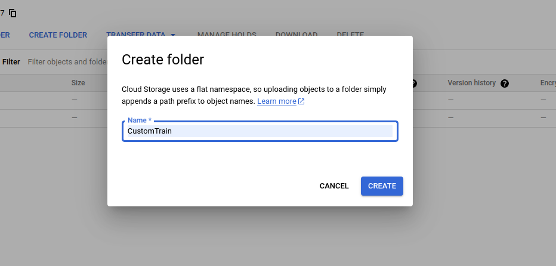
   

   

2. Then, inside of this folder, create a folder for our data.
   

   

   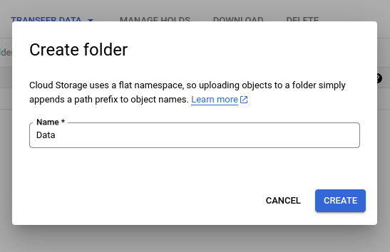
   

   

3. Upload **"Iris.csv"** from **"03_Custom_Training/Data"** to this data folder.
   

   

   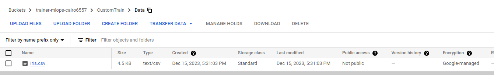
   

   

4. Next, create another folder for Custom Container named **"CustomContainer"**.
   

   

   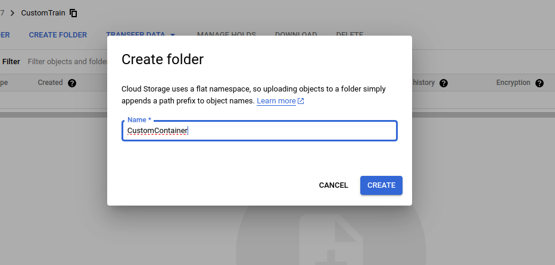
   

   

5. In this folder, create 2 folder named **"output"** and **"model"**
   

   

   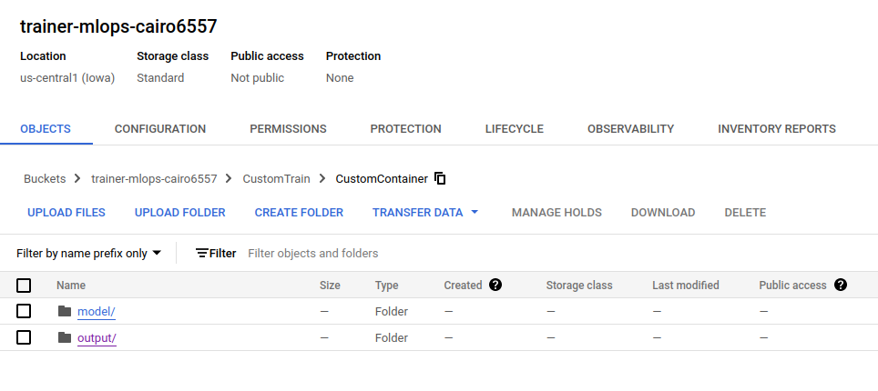
   

   

**3. Get Ready With Artifact Registry's Repository**

1. Go to your GCP console and search for **"Artifact Registry"**
2. Then, click on the **"CREATE REGISTRY"** button.
   

   

   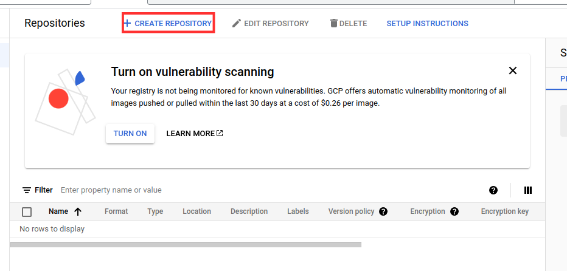
   

   

3. For the registry configuration, firstly, input the name of the repository
   

   

   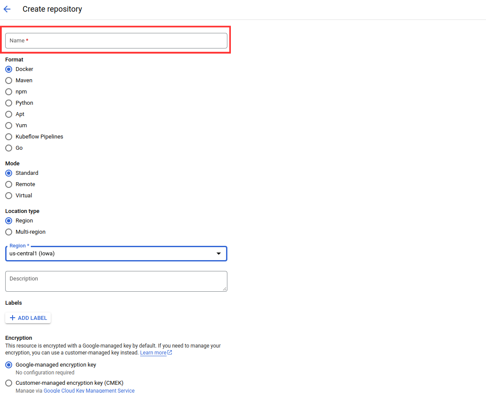
   

   

4. Then, choose the format of the artifact. As we want to store docker images, we will choose docker.
   

   

   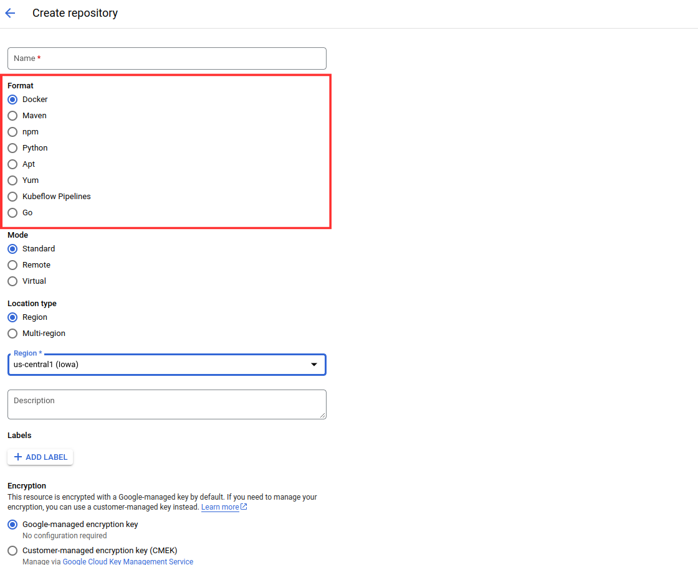
   

   

5. Then, pick the mode of the artifact. We will use the default value which is standards.
   

   

   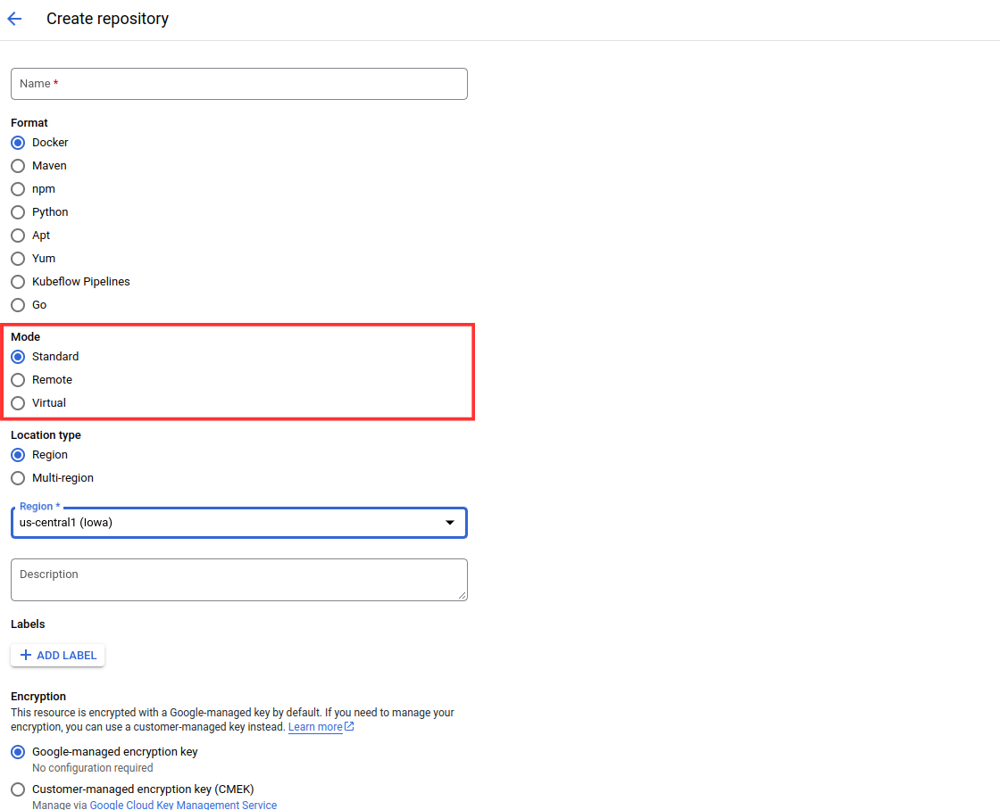
   

   

6. As the region, we will use us-central1. 

   

   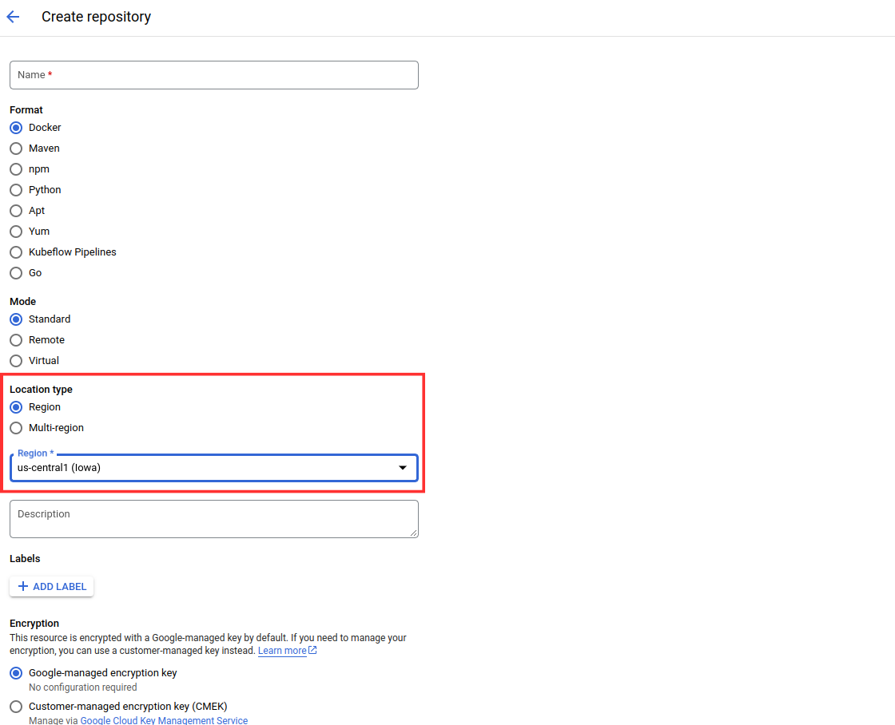
   

   

7. Just use the default value for other configurations and click **"CREATE"**.

Now we can start our topic on **Custom Train Using Custom Container**

### 1. Testing Training Code on the Instances.

- Go to your GCP console and search for **"Vertex AI"**
- On the left-sidebar, choose **"Workbench"**.
  

  

    
  

  

- On the workbench, click on the **"OPEN JUPYTERLAB"** button.
  

  

    
  

  

- Because we created prebuilt instances rather than a User-managed Notebook, we can see many kernels (environments to run the notebooks) already prepared.
  - Pytorch Kernel
  - Tensorflow Kernel
  - Python Kernel
  - etc.
    

    

      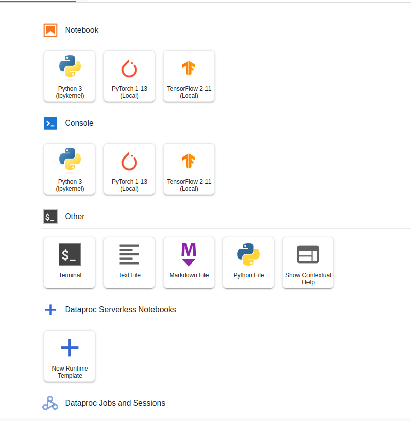
    

    

- Create a folder named **"CustomContainer"** on the notebook
  - Click this icon to create a new folder.
    

    

      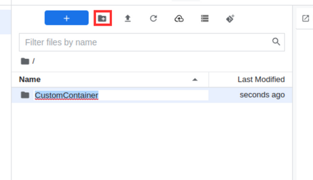
    

    

  - Then, double-click the folder to go inside it.
- Go to material folder **"03_Custom_Training/Custom_Container"** and drag & drop **""train.ipynb"** into our notebook.
  

  

    
  

  

- Double-click the **"train.ipynb"** on the notebook and choose Python 3 as the kernel.
  

  

    
  

  

- Go to your **"Iris.csv"** in the Google Cloud Bucket and copy the gsutil URI.
  

  

    
  

  

- Change this path with the copied path
  

  

    
  

  

- Then go to your custom container folder and copy its path by clicking this.
  

  

    
  

  

- Paste it into this section of code.
  

  

    
  

  

- To run all of the cells, click this button.
  

  

    
  

  

- If all processes are successfully done without any problem, you will see the **"model.pkl"** will be created on your instances as well as Google storage.
  

  

    
  

  

  

  

    
  

  

- As we do this just for testing code purposes, delete both of these **"model.pkl"** and proceed to the next step.

### 2. Preparation of Creating the Docker Image.

- Before we can create the docker image files, we need to do 3 things.
  - **Create train.py**
    - This file is our main training code. We will convert **"train.ipyb"** into **"train.py"**
  - **Create a DockerFile**
    - This file will contain some commands for docker to build our image.
  - **Create requirements.txt file**
    - This file will contain all Python libraries needed to run the **"train.py"**

1. **Convert train.ipyb into train.py**

   - Open the terminal.
   - Change the directory to our **CustomContainer** folder.
   - Use this command to convert the ipynb file into the Python file.
     > jupyter nbconvert train.ipyb --to python
   - Rename the file into **"train.py"**
   - Before completing this process, clean up the code by deleting some snippets of code like this one
     - Remove "type(data)"
     - Remove "data"
     - Remove "X_train.shape"
     - Remove "X_test.shape"
     - Remove "y_train.shape"
     - Remove "y_test.shape"
     - Remove "svn"

2. **Create requirements.txt**

   - Upload **"requirements.txt"** from material folder **"03_Custom_Training/Custom Container"** to the **"CustomContainer"** folder
   - This requirements.txt file contains all of the Python library needed for the **"train.py"** to run.
   - The content of this file should be varied according to the ML model that you choose to train.

3. **Create Dockerfile**
   - Upload **"DockerFile"** from material folder **"03_Custom_Training/Custom Container"** to the **"CustomContainer"** folder
   - This file is used when building a docker image. we will analyze the content of this file line per line
     - **"FROM python:3.7-buster"**
       - This means the docker image will take a base image of python3.7-buster. This base image is used usually from the official image released by various developers.
     - **"WORKDIR /root"**
       - This means we choose /root directory as our working directory.
     - **"COPY train.py /root/train.py"**
       - We will copy the train.py in the instances into our working directory.
     - **"COPY requirements.txt /root/requirements.txt"**
       - We also will copy the requirements.txt from the instances into our working directory.
     - **"RUN pip install -r /root/requirements.txt"**
       - This command will install all the Python libraries stated in the requirements.txt into our docker image.
     - **"ENTRYPOINT ["python", "train.py"]"**
       - Entrypoint is a command to configure the executables that will always run after the container is initiated.
       - Every time you start the docker container, this command will automatically run.

### 3. Building and Pushing the Docker Image to the Artifact Registry.

In preparation before, we already created our Artifact Registry' repository.

- If you see in the repository, the repo is empty. This is because we not pushing anything in it yet.

1. First, you will need to configure the docker. Follow these steps to do it

- In your artifact repository, click **Setup Instructions**, copy the command under **Configure Docker**.
- Paste this command into the terminal.

2. Click this icon to copy your repository path and paste it into any empty text file as we need to add docker image name and tag to it.

   - At the end of this path, add **"/[IMAGE_NAME]:[IMAGE_TAG]"** so it will be something like this. Take note that this is only an example.

     > us-central1-docker.pkg.dev/magnetic-set-406207/custom-train-container/**iris_custom_container:v1**

   - Then add **"export IMAGE_URI="** in front of the command so it will be something like this. Take note that this is only an example.
     > export IMAGE_URI=us-central1-docker.pkg.dev/magnetic-set-406207/custom-train-container/**iris_custom_container:v1**\
   - Paste this command on the terminal.

- The purpose of this command is to create an environment variable in the terminal.
- If you use this command, you will see your path as the output
  > echo $IMAGE_URI
- Then, build the docker image using this command.

  > docker build -f Dockerfile -t ${IMAGE_URI} ./

  - The "-f" represents the file in which we use the Dockerfile
  - The "-t" represents the tag is is our IMAGE_URI
  - The "./" represents the current directory

- To validate whether the image has already been created successfully, run this command. If your docker images are listed on the output, it means your images were created successfully.

  > docker image ls

- Lastly, we will push the image into our artifact repository using this command.

  > docker push ${IMAGE_URI}

### 4. Train ML Model Using Docker Image with Vertex AI.

- Go to your GCP console and search for **"Vertex AI"**
- On the left-sidebar, choose **"Training"** and click on **"TRAIN NEW MODEL"**
- The training steps for custom training are slightly the same as training using AutoML.
- These are the training steps for custom training using custom containers.

  1.  **Training Method**
      - As we prepare the dataset ourselves and do not use the dataset features in the Vertex AI, we will select "No Managed Dataset" on the **dataset option**.
      - As for the **Model training method**, we will choose the custom training.
      - Click **"Continue"**
  2.  **Model Details**
      - In this tab, we will choose **"train new model"**.
      - If you want to train a new version of an existing model, choose the other option as you can do a performance comparison between different versions of the model.
      - Then, input the name of your model.
      - Click **"Continue"**
  3.  **Training Container**
      - For this option, we will choose **"Custom Container"**.
      - In **"Custom Container Settings"**:
        - **Container Image**
          - Click **"Browse"** and choose the docker that we already push to the Artifact Registry
        - **Model Output Directory**
          - Click **"Browse"** and choose any path in your bucket to save the output model.
      - Click **"Continue"**
  4.  **Hyperparameter**
      - In this section, you can adjust the hyperparameter for your training.
      - It will train multiple model using the range of parameter that we all ready set. Then it will choose the model with best performance.
      - However, we will not changing anything.
      - Click **"Continue"**.
  5.  **Compute and Pricing**
      - In this section, as for the **Region**, we will use **"us-central1"**.
      - As for the **Machine Type**, we will only use **"n1-standard-4"** as we only need lower compute power
      - As for the **Accelerator Type**, we will choose nothing.
        - If your training code needs to use GPU, you can choose what GPU you want for your training container.
      - As for the **Disk Type**, we will use **"Standard Persistent Disk"**.
      - As for the **Disk Size**, we will use **"100GB"** as it the lowest size we can choose.
      - Click **"Continue"**.
  6.  **Prediction container**
      - As we don't have any prediction container, we will choose the **"No Prediction Container"** option.
        - If you have your prediction container, maybe you want to make some processing on the result of the model, you can push your prediction image into the the artifact registry.
      - Click **"Start Training"**.

- Check the bucket after the training is done to ensure the models are there.

  > This training only will take a few minutes. Stay tuned!

### 5. Deploy the Trained Model to an Endpoint.

- When the training process already done, you will see your model exported into your output path you already choose.
- However, in contrast to the AutoML method, the model does not register to the model registry automatically.
- Therefore, before we can deploy the trained model into an endpoint, we must register it first.
- This is the steps of registering the model into Model Registry.

  1. Go to your GCP console and search for **"Vertex AI"**
  2. On the left-sidebar, choose **"Model Registry"** and click on **"IMPORT"**
  3. There are a few configuration sections you need to choose.
     1. **Name and region**
        - This depends on you. If your model is a new version of the previous ML model, you can choose **"Import as new version"**.
        - However, for this workshop, as we don't have a previous version of the ML model, we will choose **"Import as new model"**.
        - Input the name for your model
        - Choose **Region** for your model. We will choose **"us-central1"**.
     2. **Model Settings**
        - As we don't have a prebuilt deployment container for our model, we will choose **"Import model artifacts into a new pre-built container"**.
        - In **Pre-built container settings**
          - **Model Framework**
            - We will choose **"sci-kit-learn"** because we used this framework for our ML model.
          - **Model Framework Version**
            - We will choose **"0.24"**. This is because for our training, we use this version too. It is better to use the same version for training and deployment.
          - **Model Artifact Location**
            - Click **"Browse"** and choose the path of your ML model you want to register into the Model Registry.
     3. **Explainability**
        - The explanation of these features already explained in the AutoML section.
        - Click **IMPORT** to continue

- After this, you can deploy your trained model into the endpoint.

  - Search for **Vertex AI** on the GCP search tab
  - On the left-sidebar, choose **"Model Registry"**.
  - Your model should be shown there.
      

      

        
      

      

  - Click on the model to go to the model information page.
      

      

        
      

      

  - On this page, you can check all the information about your model
    - **Precision**
      - The percentage of predictions that were correct (positive). The higher the precision, the fewer false positives predicted.
    - **Recall**
      - The percentage of all ground truth items that were successfully predicted by the model. The higher the recall, the fewer false negatives, or the fewer predictions missed.
    - **Precision-Recall Curve**
      - Trade-off between precision and recall at different confidence thresholds. A lower threshold results in higher recall but typically lower precision, while a higher threshold results in lower recall but typically with higher precision.
    - **Precision-Recall By Threshold**
      - Model performance on the top-scored label along the full range of confidence threshold values. A higher confidence threshold produces fewer false positives, which increases precision. A lower confidence threshold produces fewer false negatives, which increases recall.
    - **Confusion Matrix**
      - It represents the prediction summary in matrix form. It shows how many predictions are correct and incorrect per class. It helps in understanding the classes that are being confused by the model as other classes.
  - So to use the model for deployment, we need to create the endpoint first.

    - So here are the steps to create an endpoint:

      1.  Click on **"Deploy & Test"**, and then click **"DEPLOY TO ENDPOINT"**.
          

          

            
          

          

      2.  There will be 2 configiration bar on the endpoint creation page.

          1.  **Define Your Endpoint**
              - There are 2 choices here. -
                - **Create a new endpoint** - If you don't have or you want to create a new endpoint, choose this.
                - **Use existing endpoint** - If you already have an endpoint and want to use it, choose this.
                - Then, choose the name for your endpoint.
                  

                  

                  
                  

                  

          2.  **Model Settings**

              - **Traffic Split**

                - If you have multiple versions of the model running on one endpoint, you can split the traffic between them.
                - For example, if you want to test the deployment model performance on live data using blue/green deployment or Canary deployment, this splitting method can be helpful.
                  

                  

                  
                  

                  

              - **Number of compute nodes**

                - If you want to deploy several versions of the ML Model on one endpoint, you will need to increase your number of compute nodes.
                - However, for this training, as we only deploy 1 model, we will put the minimum amount of compute nodes which is 1.
                  

                  

                  
                  

                  

              - **Enable access logging for this endpoint**
                - You can also enable logging for your endpoint.
                - Things like request per second, prediction error percentage, latency, and many more will be recorded for future analysis.
                - If you are currently in production, you might want to leave this option enabled.
                - However, because we currently learning, I will disable this option.
                  

                  

                  
                  

                  

  > The deployment and endpoint creation will take some time about 5-10 minutes.

### 6. Testing the Endpoint.

For using the endpoint, there are some ways to do it.

- You can test your model on the model information page.

  - At the **"Deploy & Test"** tab, you can input your data in JSON format.
  - You can use the test set that is already prepared in the material folder **"/03_Custom_Training/01_Custom Container/Test/Sample/INPUT-JSON"**
  - Copy the content, paste it on the input section and click **"Predict"**
  - You will get the result like this.
    

    

    
    

    

- However, if you want to use this endpoint embedded in your code, these are the steps.

  - At "Deploy & Test" tab, click **"Sample Request"**
     

     

     
     

     

  - There will be 2 way of connecting to the endpoint which is through raw API or using Python Code.
     

     

     
     

     

     - For raw API, you can just follow the instructions given in the tab.

    - For Python code, here are the instructions.
      1.  You will need a Python module for connection which you can get from [HERE]("https://github.com/googleapis/python-aiplatform/blob/main/samples/snippets/prediction_service/predict_image_classification_sample.py). However, it will be no need for you to that as I already prepare the python code and the sample image in the material folder.
      2.  Open your Google cloud shell and upload **"03_Custom_Training/01_Custom Container/Test/Code/"** folder into it.
          

          

          
          

          

      3.  Open the editor and open the **"request_api.py"**.
          1. Copy this code snippet from **Sample Request**.
             

             

             
             

             

          2. Paste it here at the bottom of the Python file.
             

             

             
             

             

      4.  Feel free to change the parameter of the **"instances"**
      5.  After all is complete, go back to the cloud shell.
          1. If you get error saying there are no module **"aiplatform"**, you will need to install aiplatform Python Library first. Run this command to install it.
             > pip install google-cloud-aiplatform
          2. Change the directory to your **"request_api.py"**
          3. Run the Python code by using this command.
             > python request_api.py
      6.  You will get the result like this.
          

          

          
          

          

---

- If you are not using the endpoint, it will be recommended to delete it as you will be charged hourly.
- Here are the steps to delete an endpoint.
  - You will need to undeployed the model first.
    - Search for **Vertex AI** on the GCP search tab
    - On the left-side navbar, choose **"Online Prediction"** and choose the endpoint you want to close.
      

      

        
      

      

    - Click on the 3 dots at the end of the model information and choose **"Undeploy model from endpoint"**
      

      

      
      

      

    - Go back and click on the 3 dots again and choose **"Delete endpoint"**
      

      

      
      

      

