# mlops-training-cairo-utm

### Prerequisites

**1. Choose or Create New Project**

- Go to your GCP console and click on this drop-down menu.
  

  

    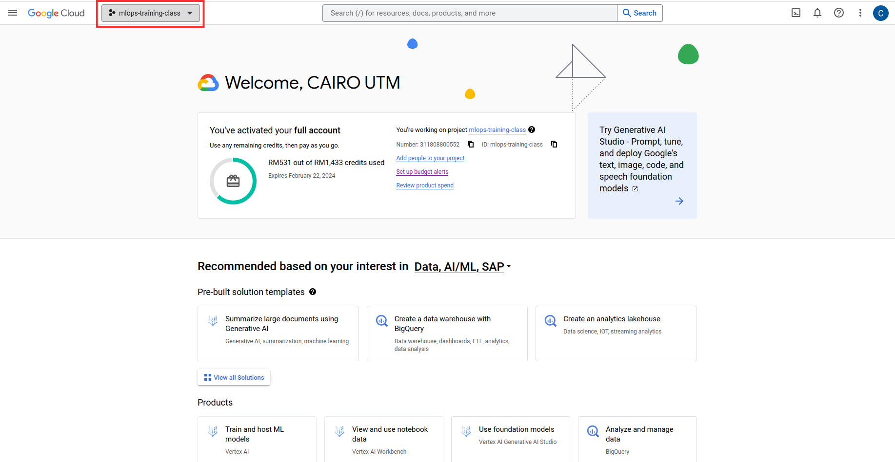
  

  

- This menu will pop up where you can create a new project or choose a project which already been created.
  

  

    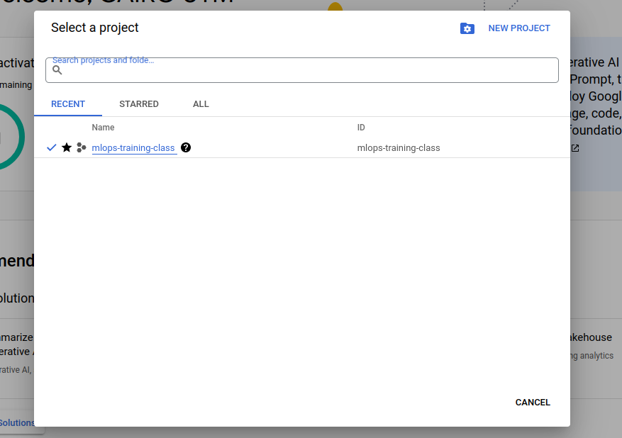
  

  

**2. Create a Bucket on Cloud Storage For Your Project**

- Go to your GCP console and search for **Google Storage**
  

  

    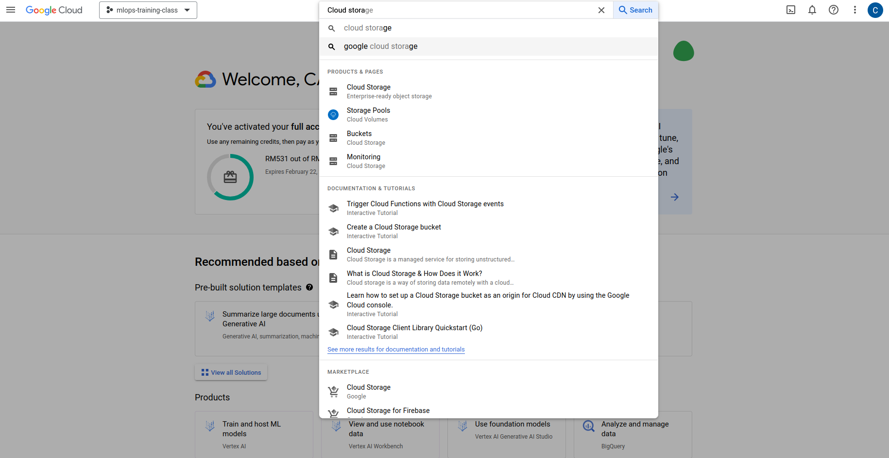
  

  

- Click on **Create** and fill up all the bucket configuration.
  

  

    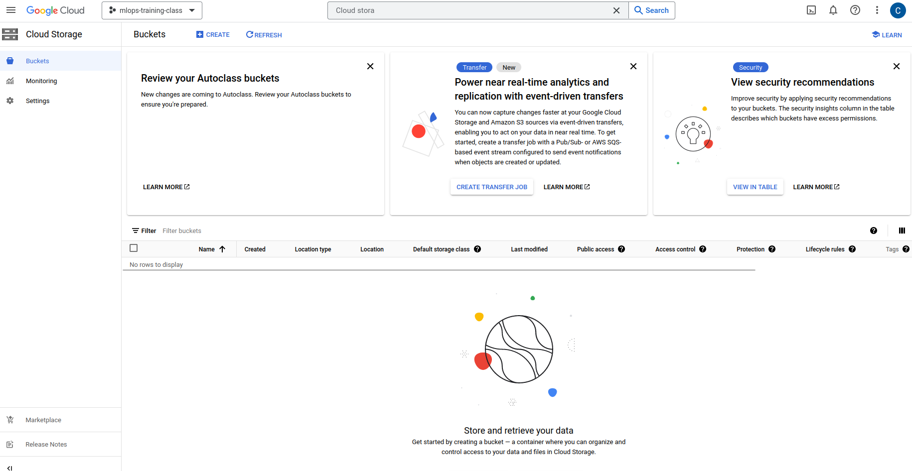
  

  

- This is the recommended settings for Cloud Storage's bucket for the workshop.
  - Pick your bucket name.
    

    

      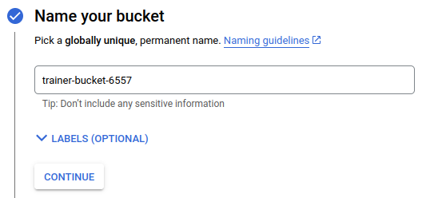
    

    

  - Pick your bucket region(Recommended:us-central1).
    

    

      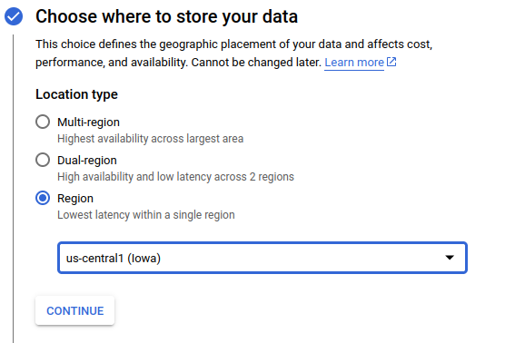
    

    

  - Pick your bucket's storage class.
    

    

      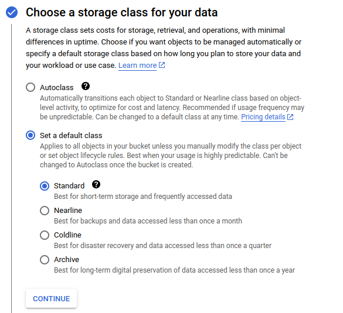
    

    

  - Pick your bucket's access.
    

    

      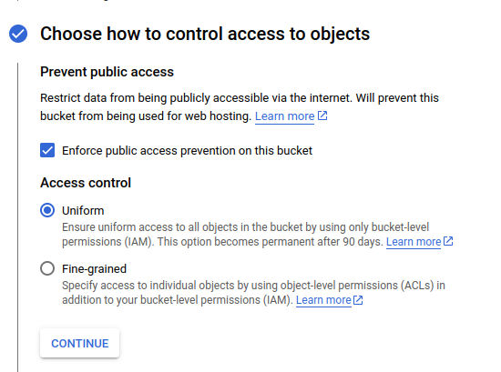
    

    

  - Pick your bucket's data protection.
    

      

        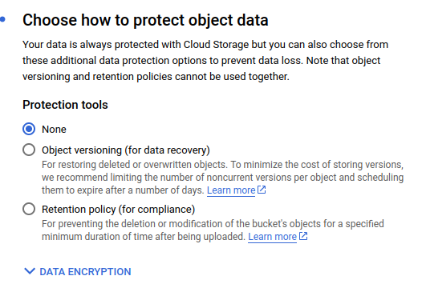
      

      

  - After the bucket created, your will be redirect inside your bucket.
    

    

      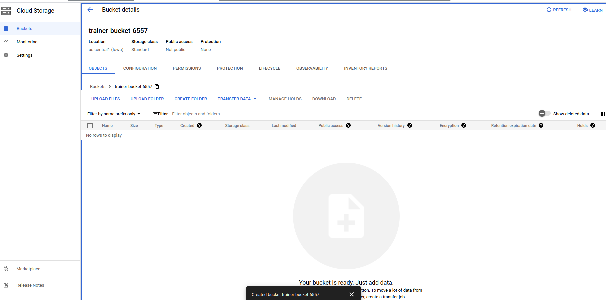
    

    

**3. Enable all of the API Needed**

- Go to your GCP console and search for **Vision AI API**
  - **Enable** the **Vision AI API**
  - 

    

      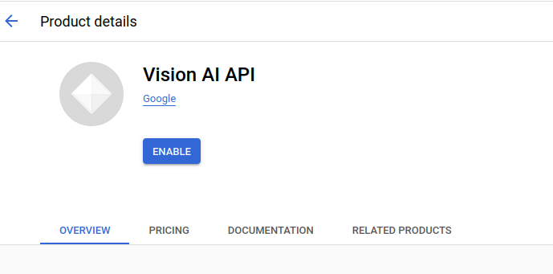
    

    

- Go to your GCP console and search for **Cloud Natural Language API**
  - **Enable** the **Cloud Natural Language API**
    

    

      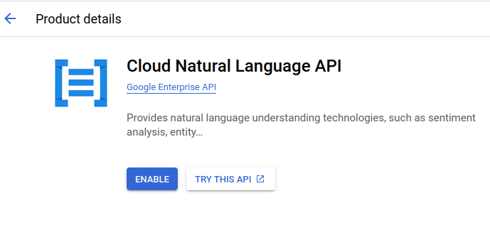
    

    

- Go to your GCP console and search for **Cloud Speech-to-Text API**
  - **Enable** the **Cloud Speech-to-Text API**
    

    

      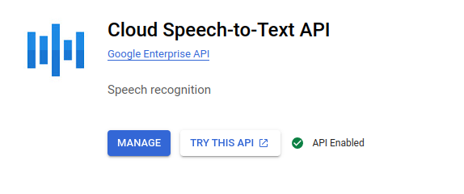
    

    

- Go to your GCP console and search for **Vertex AI**
  - **Enable** the **Vertex AI** by clicking **ENABLE ALL RECOMMENDED APIS**
    

    

      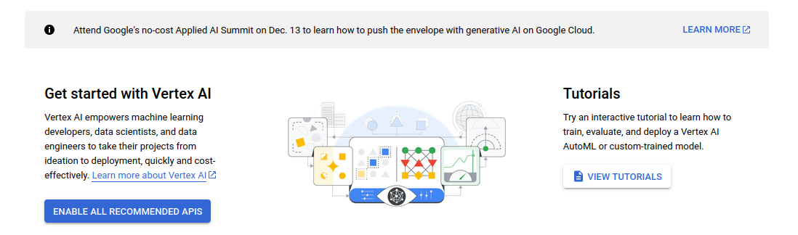
    

    

